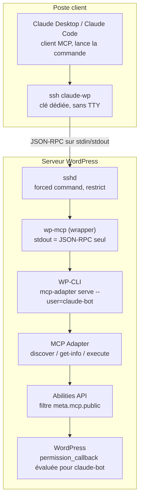

# Tuto : connecter Claude à WordPress via MCP Adapter (transport STDIO / WP-CLI over SSH)

## Architecture et prérequis

Claude lance `ssh claude-wp` comme un serveur MCP local ; SSH force l'exécution de `wp-mcp`, qui démarre `wp mcp-adapter serve` en tant que `claude-bot`. Aucun port HTTP exposé, aucun mot de passe applicatif, aucun Node côté serveur.



Le flux JSON-RPC traverse SSH sur stdin/stdout ; chaque appel franchit ensuite trois verrous indépendants : la clé restreinte, le rôle WordPress, le flag `meta.mcp.public`.

Le guide officiel documente STDIO via WP-CLI pour une install locale ; l'encapsuler dans SSH étend ce transport à un serveur distant sans rien changer côté WordPress.

Prérequis :

- **Serveur** : WordPress ≥ 6.9 (Abilities API), PHP CLI ≥ 7.4, WP-CLI, accès SSH avec un utilisateur Unix non root.
- **Client** : Claude Desktop ou Claude Code, OpenSSH, `jq` pour les tests. Node uniquement pour MCP Inspector, optionnel.
- **STDIO plutôt que HTTP** : aucun endpoint MCP public, authentification déléguée à SSH, utilisateur WordPress fixé côté serveur et jamais choisi par le client.

## Étape 1 — WP-CLI sur le serveur

WP-CLI doit être exécutable par l'utilisateur Unix qui recevra la connexion SSH, avec accès en lecture à l'install et en écriture là où WordPress écrit (uploads, cache).

```bash
# On the WordPress host
curl -O https://raw.githubusercontent.com/wp-cli/builds/gh-pages/phar/wp-cli.phar
php wp-cli.phar --info
chmod +x wp-cli.phar
sudo mv wp-cli.phar /usr/local/bin/wp

# Sanity checks, run as the Unix user that SSH will log in as
wp --info
wp --path=/var/www/site core version   # must be >= 6.9 (Abilities API)
wp --path=/var/www/site eval 'echo function_exists("wp_register_ability") ? "abilities: ok" : "abilities: missing";'
```

Utilisateur Unix : le propriétaire des fichiers du site (ex. `deploy`) ou un compte dédié membre du groupe `www-data`. Éviter `root` : WP-CLI le refuse sans `--allow-root`, et un forced command root est une porte ouverte.

Remplacer `/var/www/site` par le chemin réel partout dans ce tuto.

## Étape 2 — Installer le MCP Adapter

L'adapter s'installe comme plugin depuis les [Releases GitHub](https://github.com/WordPress/mcp-adapter/releases). À l'activation, il enregistre le serveur `mcp-adapter-default-server` et trois tools : `mcp-adapter-discover-abilities`, `mcp-adapter-get-ability-info`, `mcp-adapter-execute-ability`. Il n'est pas dans le core, même en WordPress 7.0.

```bash
cd /var/www/site

# Copy the exact .zip asset URL from the Releases page (asset name varies by version)
wp plugin install "https://github.com/WordPress/mcp-adapter/releases/download/<TAG>/<ASSET>.zip" --activate

# Verify
wp plugin list --status=active | grep -i mcp
wp help mcp-adapter          # lists available subcommands, including `serve`
```

Alternative Composer (si le site est géré en Composer, type Bedrock) : `composer require wordpress/mcp-adapter`, puis initialiser `WP\MCP\Core\McpAdapter::instance()` dans un plugin. Le plugin zip suffit pour ce tuto.

Prérequis PHP : 7.4 minimum, 8.1+ recommandé.

## Étape 3 — Utilisateur WordPress dédié

Le flag `--user` de `mcp-adapter serve` fixe l'utilisateur WordPress courant : chaque `permission_callback` est évaluée contre lui. C'est la frontière de sécurité réelle, pas SSH. Ne jamais utiliser `admin`.

```bash
cd /var/www/site

# Custom role: start from author (edit/publish own posts, upload files), trim as needed
wp role create mcp_agent "MCP Agent" --clone=author
wp cap remove mcp_agent publish_posts      # drafts only; remove this line to allow publishing

wp user create claude-bot claude-bot@example.invalid \
  --role=mcp_agent \
  --display_name="Claude (MCP)" \
  --user_pass="$(openssl rand -base64 32)"

wp user get claude-bot --field=roles
wp cap list mcp_agent
```

Pas de mot de passe à retenir : la session STDIO ne s'authentifie pas par HTTP, WP-CLI pose l'utilisateur directement. Le mot de passe aléatoire empêche seulement une connexion web avec ce compte.

Si une ability core (ex. `core/get-environment-info`) exige une capacité admin, elle échouera avec ce rôle : comportement voulu.

## Étape 4 — Exposer des abilities

Une ability n'apparaît sur le serveur par défaut que si `meta.mcp.public` vaut `true`. Les abilities core (`core/get-site-info`, `core/get-user-info`, `core/get-environment-info`) se rendent publiques via le filtre `wp_register_ability_args`. Les tiennes déclarent le flag directement.

Fichier : `wp-content/mu-plugins/claude-mcp-abilities.php` (mu-plugin : toujours chargé, non désactivable depuis l'admin).

```php
<?php
/**
 * Plugin Name: Claude MCP abilities
 * Description: Exposes selected abilities to the MCP Adapter default server.
 */

defined( 'ABSPATH' ) || exit;

// 1. Make core read-only abilities visible to MCP.
add_filter( 'wp_register_ability_args', function ( array $args, string $name ) {
    $core = array( 'core/get-site-info', 'core/get-user-info', 'core/get-environment-info' );
    if ( in_array( $name, $core, true ) ) {
        $args['meta']['mcp']['public'] = true;
    }
    return $args;
}, 10, 2 );

// 2. Category for custom abilities.
add_action( 'wp_abilities_api_categories_init', function () {
    wp_register_ability_category( 'mysite', array(
        'label'       => 'My site',
        'description' => 'Custom operations for this site.',
    ) );
} );

// 3. Custom abilities.
add_action( 'wp_abilities_api_init', function () {

    // Read-only: list recent posts.
    wp_register_ability( 'mysite/list-recent-posts', array(
        'label'        => 'List recent posts',
        'description'  => 'Returns the most recent posts with ID, title, status, date and permalink.',
        'category'     => 'mysite',
        'input_schema' => array(
            'type'       => 'object',
            'properties' => array(
                'limit'  => array( 'type' => 'integer', 'minimum' => 1, 'maximum' => 50, 'default' => 10 ),
                'status' => array( 'type' => 'string', 'enum' => array( 'publish', 'draft', 'any' ), 'default' => 'publish' ),
            ),
        ),
        'output_schema' => array(
            'type'  => 'array',
            'items' => array( 'type' => 'object' ),
        ),
        'execute_callback' => function ( $input = array() ) {
            $posts = get_posts( array(
                'numberposts' => (int) ( $input['limit'] ?? 10 ),
                'post_status' => $input['status'] ?? 'publish',
            ) );
            return array_map( fn( $p ) => array(
                'id'        => $p->ID,
                'title'     => get_the_title( $p ),
                'status'    => $p->post_status,
                'date'      => $p->post_date_gmt,
                'permalink' => get_permalink( $p ),
            ), $posts );
        },
        'permission_callback' => fn() => current_user_can( 'edit_posts' ),
        'meta' => array(
            'annotations' => array( 'readonly' => true, 'destructive' => false ),
            'mcp'         => array( 'public' => true ),
        ),
    ) );

    // Write: create a draft (never publishes).
    wp_register_ability( 'mysite/create-draft', array(
        'label'        => 'Create draft post',
        'description'  => 'Creates a draft post. Content is HTML or block markup. Never publishes.',
        'category'     => 'mysite',
        'input_schema' => array(
            'type'       => 'object',
            'properties' => array(
                'title'   => array( 'type' => 'string', 'minLength' => 1 ),
                'content' => array( 'type' => 'string' ),
                'excerpt' => array( 'type' => 'string' ),
            ),
            'required'   => array( 'title' ),
        ),
        'output_schema' => array(
            'type'       => 'object',
            'properties' => array(
                'post_id'  => array( 'type' => 'integer' ),
                'edit_url' => array( 'type' => 'string' ),
            ),
        ),
        'execute_callback' => function ( $input ) {
            $id = wp_insert_post( array(
                'post_title'   => sanitize_text_field( $input['title'] ),
                'post_content' => wp_kses_post( $input['content'] ?? '' ),
                'post_excerpt' => sanitize_textarea_field( $input['excerpt'] ?? '' ),
                'post_status'  => 'draft',
                'post_author'  => get_current_user_id(),
            ), true );
            if ( is_wp_error( $id ) ) {
                return $id;
            }
            return array(
                'post_id'  => $id,
                'edit_url' => admin_url( 'post.php?post=' . $id . '&action=edit' ),
            );
        },
        'permission_callback' => fn() => current_user_can( 'edit_posts' ),
        'meta' => array(
            'annotations' => array( 'readonly' => false, 'destructive' => false, 'idempotent' => false ),
            'mcp'         => array( 'public' => true ),
        ),
    ) );
} );
```

Vérification hors MCP, directement via l'API PHP :

```bash
cd /var/www/site
wp eval 'var_dump( (bool) wp_get_ability( "mysite/list-recent-posts" ) );'
wp eval --user=claude-bot 'print_r( wp_get_ability( "mysite/list-recent-posts" )->execute( array( "limit" => 3 ) ) );'
```

Règles de conception : une ability = une opération atomique ; schémas stricts (enum, bornes, required) car c'est ce que Claude lit pour appeler l'outil ; `description` rédigée pour un agent (ce que fait l'outil, ce qu'il ne fait pas) ; jamais `__return_true` comme `permission_callback` sur une écriture. Signatures (hooks, `wp_register_ability_category`, clés `annotations`) à valider contre la [doc Abilities API](https://developer.wordpress.org/apis/abilities/) de ta version.

## Étape 5 — Tester le serveur MCP sur l'hôte

Avant tout SSH : valider que `mcp-adapter serve` parle JSON-RPC proprement sur stdout. Une seule ligne non-JSON sur stdout (warning PHP, echo d'un plugin, BOM) casse le transport.

Wrapper serveur `/usr/local/bin/wp-mcp` (utilisé aussi par le forced command de l'étape 6) :

```bash
#!/usr/bin/env bash
# MCP STDIO entrypoint: stdout = JSON-RPC only, everything else to a log.
set -euo pipefail

WP_PATH="/var/www/site"
MCP_USER="claude-bot"
MCP_SERVER="mcp-adapter-default-server"
LOG="${HOME}/.wp-mcp/stderr.log"
mkdir -p "$(dirname "$LOG")"

cd "$WP_PATH"
# display_errors=stderr keeps PHP notices off the JSON-RPC stream
exec php -d display_errors=stderr -d log_errors=On \
  /usr/local/bin/wp --path="$WP_PATH" \
  mcp-adapter serve --server="$MCP_SERVER" --user="$MCP_USER" \
  2>>"$LOG"
```

```bash
sudo chmod 755 /usr/local/bin/wp-mcp
```

Handshake + liste des tools, sur l'hôte :

```bash
printf '%s\n' \
 '{"jsonrpc":"2.0","id":1,"method":"initialize","params":{"protocolVersion":"2025-06-18","capabilities":{},"clientInfo":{"name":"smoke-test","version":"0"}}}' \
 '{"jsonrpc":"2.0","method":"notifications/initialized"}' \
 '{"jsonrpc":"2.0","id":2,"method":"tools/list"}' \
 '{"jsonrpc":"2.0","id":3,"method":"tools/call","params":{"name":"mcp-adapter-discover-abilities","arguments":{}}}' \
 | /usr/local/bin/wp-mcp | jq -c '{id, ok: (has("result")), err: .error.message}'
```

Attendu : trois réponses (`id` 1, 2, 3), toutes `ok: true` ; la réponse 3 liste `core/get-site-info`, `mysite/list-recent-posts`, `mysite/create-draft`. Si `jq` échoue sur une ligne, stdout est pollué : voir Dépannage. Lire `~/.wp-mcp/stderr.log` en cas de réponse vide.

## Étape 6 — SSH : clé dédiée et forced command

Une clé SSH réservée à Claude, verrouillée côté serveur sur une seule commande : `wp-mcp`. Même compromise, elle n'ouvre ni shell, ni tunnel, ni autre commande.

1. Générer la clé sur la machine cliente (sans passphrase : Claude Desktop ne peut pas la saisir ; la restriction serveur compense).

   ```bash
   ssh-keygen -t ed25519 -f ~/.ssh/claude_wp -N "" -C "claude-mcp@$(hostname)"
   cat ~/.ssh/claude_wp.pub
   ```

2. Côté serveur, ajouter la clé publique dans `~/.ssh/authorized_keys` de l'utilisateur Unix de l'étape 1, préfixée par les restrictions (une seule ligne) :

   ```text
   restrict,command="/usr/local/bin/wp-mcp" ssh-ed25519 AAAAC3Nza...REPLACE... claude-mcp@laptop
   ```

   `restrict` coupe PTY, port/agent/X11 forwarding (OpenSSH ≥ 7.2). `command=` ignore toute commande envoyée par le client et lance `wp-mcp`. Ajouter `from="203.0.113.0/24",` avant `command=` si l'IP cliente est fixe.

3. Alias côté client, dans `~/.ssh/config` :

   ```text
   Host claude-wp
       HostName wp.example.com
       User deploy
       Port 22
       IdentityFile ~/.ssh/claude_wp
       IdentitiesOnly yes
       RequestTTY no
       LogLevel ERROR
       ServerAliveInterval 30
       ServerAliveCountMax 3
   ```

   `RequestTTY no` : un TTY injecterait des `\r` dans le flux JSON. `LogLevel ERROR` : supprime les messages SSH parasites sur stderr.

4. Accepter l'empreinte de l'hôte une fois, en terminal (Claude Desktop ne peut pas répondre au prompt `yes/no`) :

   ```bash
   ssh-keyscan -H wp.example.com >> ~/.ssh/known_hosts
   ```

5. Tester depuis le client, même handshake qu'à l'étape 5, via SSH :

   ```bash
   printf '%s\n' \
    '{"jsonrpc":"2.0","id":1,"method":"initialize","params":{"protocolVersion":"2025-06-18","capabilities":{},"clientInfo":{"name":"smoke-test","version":"0"}}}' \
    '{"jsonrpc":"2.0","method":"notifications/initialized"}' \
    '{"jsonrpc":"2.0","id":2,"method":"tools/list"}' \
    | ssh claude-wp | jq -c '{id, ok: (has("result"))}'

   # Proves no shell access: forced command ignores 'id', runs wp-mcp, which exits on EOF.
   # Must NOT print "uid=..."
   ssh claude-wp id < /dev/null
   ```

6. Inspection interactive optionnelle avec MCP Inspector (Node requis côté client uniquement) :

   ```bash
   npx @modelcontextprotocol/inspector ssh claude-wp
   ```

## Étape 7 — Brancher Claude Desktop et Claude Code

Le forced command fait tout le travail : côté client, la commande MCP se réduit à `ssh claude-wp`. Aucun Node, aucun mot de passe applicatif.

### Claude Desktop

Settings → Developer → Local MCP servers → Edit config. Fichier `claude_desktop_config.json` :

```json
{
  "mcpServers": {
    "wordpress": {
      "command": "/usr/bin/ssh",
      "args": ["claude-wp"]
    }
  }
}
```

Windows (OpenSSH natif) :

```json
{
  "mcpServers": {
    "wordpress": {
      "command": "C:\\Windows\\System32\\OpenSSH\\ssh.exe",
      "args": ["claude-wp"]
    }
  }
}
```

Chemin absolu de `ssh` obligatoire : Claude Desktop ne charge pas le `PATH` du shell. Redémarrer complètement l'application : la config n'est lue qu'au démarrage. Le serveur doit apparaître avec le statut `running`.

### Claude Code

```bash
# User scope: available in every project
claude mcp add wordpress --scope user -- ssh claude-wp

claude mcp list
```

Ou par projet, fichier `.mcp.json` à la racine du dépôt (versionnable, partagé avec l'équipe ; chaque membre a sa propre clé et son alias `claude-wp`) :

```json
{
  "mcpServers": {
    "wordpress": {
      "command": "ssh",
      "args": ["claude-wp"]
    }
  }
}
```

Dans une session : `/mcp` affiche l'état de la connexion et les tools chargés.

### Plusieurs sites ou serveurs

Une clé et un alias par couple site/serveur MCP (ex. `claude-wp-staging`, `claude-wp-prod`), chacun avec son forced command pointant vers un wrapper différent (`--path`, `--server`, `--user` distincts). Côté Claude, une entrée `mcpServers` par alias.

## Étape 8 — Vérifier dans Claude

Claude ne voit que trois tools génériques ; il découvre les abilities puis exécute celle qui convient. Chaque prompt de test doit donc produire la séquence discover → execute.

| Prompt                                                              | Ability exécutée                                   | Contrôle côté serveur                                                            |
| ------------------------------------------------------------------- | -------------------------------------------------- | -------------------------------------------------------------------------------- |
| « Donne-moi les infos du site WordPress. »                          | `core/get-site-info`                               | Nom et URL du site corrects                                                      |
| « Liste les 5 derniers brouillons. »                                | `mysite/list-recent-posts` (limit 5, status draft) | `wp post list --post_status=draft --posts_per_page=5`                            |
| « Crée un brouillon intitulé Test MCP avec un paragraphe d'intro. » | `mysite/create-draft`                              | `wp post list --post_status=draft --author=$(wp user get claude-bot --field=ID)` |
| « Publie ce brouillon. »                                            | aucune                                             | Refus attendu : aucune ability de publication, et `publish_posts` retiré au rôle |

Le quatrième test valide la frontière : Claude doit répondre qu'il n'a pas d'outil pour publier. S'il y parvient, une ability exposée est trop large.

Claude Desktop demande une approbation à chaque appel d'outil. Garder ce comportement tant que les abilities d'écriture ne sont pas éprouvées.

## Dépannage

Premier réflexe : relancer le test de l'étape 6 en terminal ; s'il passe, le problème est côté client Claude, sinon côté serveur. Logs : `~/.wp-mcp/stderr.log` sur l'hôte ; Claude Desktop écrit les siens dans `~/Library/Logs/Claude/mcp-server-wordpress.log` (macOS) ou `%APPDATA%\Claude\logs\` (Windows).

| Symptôme                                                | Cause probable                                                                                       | Correctif                                                                                            |
| ------------------------------------------------------- | ---------------------------------------------------------------------------------------------------- | ---------------------------------------------------------------------------------------------------- |
| Serveur `failed` immédiatement dans Claude Desktop      | `ssh` introuvable ou prompt interactif (host key, passphrase)                                        | Chemin absolu de `ssh`, `ssh-keyscan` vers `known_hosts`, clé sans passphrase                        |
| `Unexpected token` / JSON invalide dans les logs client | stdout pollué : warning PHP, `echo` d'un plugin ou du thème, BOM dans un fichier PHP, bannière shell | `display_errors=stderr` (wrapper), `WP_DEBUG_DISPLAY` à `false`, tester avec `wp-mcp \| head -c 200` |
| Bannière ou texte avant le JSON                         | `.bashrc` / `.profile` qui affichent du texte en session non interactive                             | Encadrer ces sorties par `[[ $- == *i* ]]`, ou forced command (le wrapper n'en hérite pas)           |
| `Error: 'mcp-adapter' is not a registered wp command`   | Plugin inactif, mauvais `--path`, ou multisite sans `--url`                                          | `wp plugin list`, vérifier `WP_PATH`, ajouter `--url=https://site` en multisite                      |
| `tools/list` OK mais l'ability manque dans discover     | `meta.mcp.public` absent, mauvais hook, catégorie non enregistrée                                    | `wp eval 'var_dump(wp_get_ability("mysite/x"));'`, relire l'étape 4                                  |
| Ability listée mais exécution refusée                   | `permission_callback` false pour `claude-bot`                                                        | `wp user get claude-bot --field=roles`, `wp cap list mcp_agent`                                      |
| `Permission denied (publickey)`                         | Clé non chargée ou ligne `authorized_keys` mal formée                                                | `ssh -v claude-wp`, droits `700` sur `~/.ssh`, `600` sur `authorized_keys`                           |
| Déconnexions après inactivité                           | NAT ou firewall coupe la session TCP                                                                 | `ServerAliveInterval 30` (déjà dans la config), `ClientAliveInterval` côté `sshd`                    |
| Erreurs mémoire ou timeouts sur gros sites              | Limites PHP CLI                                                                                      | `-d memory_limit=512M` dans le wrapper                                                               |

## Durcissement

Trois verrous indépendants : SSH limite *qui* entre et *quoi* tourne, le rôle WordPress limite *ce qui est permis*, les abilities limitent *ce qui existe*. Chacun doit tenir seul.

- **Staging d'abord.** Brancher Claude sur une copie du site tant que les abilities d'écriture ne sont pas validées.
- **Lecture seule par défaut.** N'exposer une ability d'écriture que pour un besoin précis ; jamais de suppression, de changement de rôle ou d'option globale exposée sans garde-fou explicite.
- **Serveur MCP dédié plutôt que le serveur par défaut.** Un serveur créé via `create_server()` liste explicitement ses abilities : un plugin tiers qui marque ses abilities `mcp.public` n'y apparaît pas à ton insu.
- **Forced command + `restrict` + `from=`.** La clé ne sert qu'à `wp-mcp`, depuis des IP connues.
- **Utilisateur Unix sans sudo**, propriétaire minimal des fichiers ; pas de clé partagée avec les déploiements.
- **Journalisation.** Tracer les exécutions dans `execute_callback` (ou un handler d'observabilité custom de l'adapter) : ability, input, utilisateur, horodatage.
- **Rotation.** Révoquer la clé (supprimer la ligne `authorized_keys`) à chaque changement de poste ; désactiver `claude-bot` suffit à couper l'accès WordPress sans toucher SSH.
- **Mises à jour.** L'adapter est en 0.x : épingler la version, lire les notes de version avant upgrade, retester l'étape 5.

## Sources

- [From Abilities to AI Agents: Introducing the WordPress MCP Adapter](https://developer.wordpress.org/news/2026/02/from-abilities-to-ai-agents-introducing-the-wordpress-mcp-adapter/) — WordPress Developer Blog, 4 février 2026
- [WordPress/mcp-adapter](https://github.com/WordPress/mcp-adapter) — dépôt officiel, releases et docs
- [Abilities API](https://developer.wordpress.org/apis/abilities/) — documentation développeur